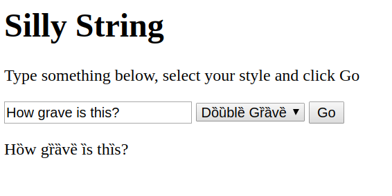

# Silly String
Add visual flourish to text via CLI or web

## Usage:
```bash
$ ./sillystring -h
Usage of ./sillystring:
   -a  acute
  -ca  caron
  -ci  circumflex
   -d  diaeresis
  -da  dot_above
  -db  dot_below
   -f  fraktur
   -g  grave
  -ho  hook
   -p  port of server
   -s  run http server
   -t  tilde

$ ./sillystring -a Acute
Áćúté

$ ./sillystring -s
Serving at localhost:8080
```

## Web interface looks like:


## To install
- install Go 
- clone this repo
- run `go build`

## Useful links to add translations
https://www.fileformat.info/info/unicode/char/search.htm
http://unicode-search.net/unicode-namesearch.pl
https://unicode-table.com/en/blocks/
