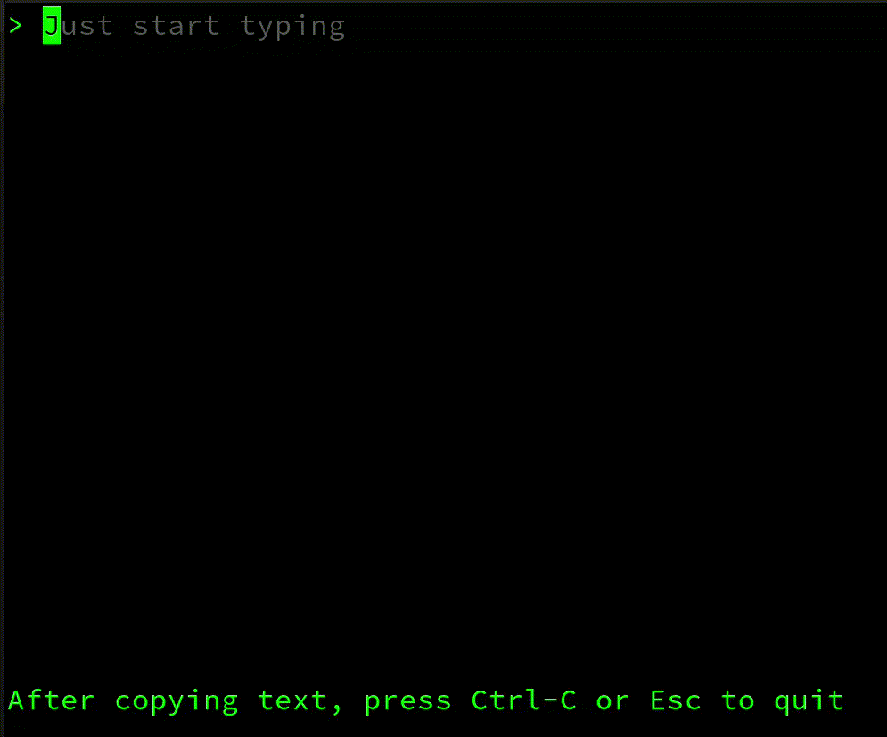

# Silly String
Add visual flourish to text via TUI, web or CLI


## Terminal UI:
```bash
$ ./sillystring_tui
```


## Web UI:
```bash
$ ./sillystring_web -h
Usage of ./sillystring_web:
   -p  port of server
   -s  run http server

$ ./sillystring_web -s
Serving at localhost:8080
```


## CLI:
```bash
$ ./sillystring_cli -h
Usage of ./sillystring_cli:
   -a  acute
  -ca  caron
  -ci  circumflex
   -d  diaeresis
  -da  dot_above
  -db  dot_below
   -f  fraktur
   -g  grave
  -ho  hook
   -t  tilde
$ ./sillystring_cli -da silly string
ṡillẏ ṡṫṙiṅġ
```

## To install
- install Go 
- clone this repo
- run one of:
  - `go build -o sillystring_tui cmd/sillystring_tui/main.go`
  - `go build -o sillystring_web cmd/sillystring_web/main.go`
  - `go build -o sillystring_cli cmd/sillystring_cli/main.go`

## Useful links to add translations
https://www.fileformat.info/info/unicode/char/search.htm
http://unicode-search.net/unicode-namesearch.pl
https://unicode-table.com/en/blocks/
